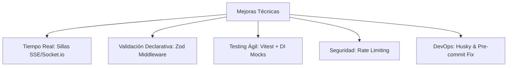

# Plan de Mejoras Técnicas y Arquitectónicas — MultiCine Backend

Este documento detalla el plan de implementación para las 5 mejoras arquitectónicas prioritarias, orientadas a la robustez, seguridad, rendimiento en tiempo real y calidad de código del backend de **MultiCine**.

---

## 1. Objetivos del Plan



---

## 2. Desglose de Mejoras

### ⚡ Mejora 1: Actualización en Tiempo Real de Sillas (SSE / Server-Sent Events)
* **Objetivo**: Reflejar instantáneamente el bloqueo o liberación de sillas a todos los clientes que estén visualizando la misma función de cine sin necesidad de recargar la página (`polling`).
* **Enfoque Tecnológico**: **Server-Sent Events (SSE)** o **Socket.io**. SSE es ideal y nativo sobre HTTP/2 para flujos unidireccionales servidor → cliente, con reconexión automática y sin overhead de protocolo.
* **Componentes a Implementar**:
  1. `EventStreamService` o `SeatNotificationService` en `src/services/`.
  2. Endpoint `GET /api/v1/functions/:id/seats/stream` (SSE).
  3. Emisión de eventos `SEAT_LOCKED` y `SEAT_RELEASED` en `ReservationService.lockSeats` y `ReservationService.releaseSeats`.
* **Eventos de Dominio**:
  ```json
  {
    "event": "seat:locked",
    "functionId": 1,
    "seatIds": [1, 19],
    "expiresAt": "2026-09-04T18:00:00.000Z"
  }
  ```

---

### 🛡️ Mejora 2: Validación Centralizada con Zod Middleware
* **Objetivo**: Interceptar y validar `req.body`, `req.query` y `req.params` mediante esquemas fuertemente tipados antes de que la petición ingrese al controlador.
* **Beneficios**: Elimina código repetitivo de parseo manual (`Number.parseInt`), estandariza respuestas `400 Bad Request` y garantiza tipado inferido (`z.infer<typeof schema>`).
* **Componentes a Implementar**:
  1. `validateRequest(schema: ZodSchema)` en `src/middleware/validate.middleware.ts`.
  2. Esquemas de validación Zod en `src/schemas/`:
     - `auth.schemas.ts` (Login, Register, PasswordReset).
     - `reservation.schemas.ts` (LockSeats, ReleaseSeats).
     - `cart.schemas.ts` (CreateCart, UpdateCart, AddItems).
     - `movie.schemas.ts` (Filters, Upcoming).

---

### 🧪 Mejora 3: Suite de Pruebas Unitarias e Integración con Vitest
* **Objetivo**: Reemplazar Jest por **Vitest**, el cual tiene soporte nativo y de cero configuración para ECMAScript Modules (`nodenext`), TypeScript y ejecución ultrarrápida multihilo.
* **Alineación con `AGENTS.md`**:
  - Al no usar singletons, cada servicio (`AuthService`, `ReservationService`, `CartService`, etc.) puede ser instanciado en los tests inyectando repositorios falsos con `vi.fn()`:
  ```ts
  const mockReservationRepo: IReservationRepository = {
    createReservation: vi.fn().mockResolvedValue(mockReservation),
    releaseReservation: vi.fn(),
    findActiveReservationBySeat: vi.fn().mockResolvedValue(null),
    // ...
  };
  const service = new ReservationService(mockReservationRepo, mockSeatRepo, mockFnRepo);
  ```
* **Metas de Cobertura**:
  - `AuthService`: 100% de reglas de negocio (bloqueo por 5 intentos, tokens expirados, rotación).
  - `ReservationService`: Bloqueo de 10 min, cálculo de factores de precio (VIP/General), concurrencia.
  - `CartService`: Cálculo de subtotales, stock de confitería y expiración.

---

### 🔧 Mejora 4: Corrección de Husky y Pre-commit en Root
* **Problema**: El hook de pre-commit falla en local porque busca `lint-staged` y `eslint` en la raíz del repositorio, pero las dependencias están instaladas en el subdirectorio `app/`.
* **Solución**:
  1. Configurar `.husky/pre-commit` para cambiar al directorio `app/` antes de ejecutar `lint-staged` o `npm run lint`:
     ```bash
     #!/usr/bin/env sh
     . "$(dirname -- "$0")/_/husky.sh"

     cd app && npm run lint && npm run build
     ```
  2. Asegurar que los commits se validen automáticamente sin requerir `--no-verify`.

---

### 🔒 Mejora 5: Rate Limiting en Endpoints Críticos
* **Objetivo**: Proteger el backend contra ataques de fuerza bruta, DoS y acaparamiento malicioso de sillas.
* **Límites Recomendados (`express-rate-limit`)**:
  - `POST /api/v1/auth/login`: Máximo 5 intentos por ventana de 15 minutos por IP (alineado con RN-027).
  - `POST /api/v1/auth/forgot-password`: Máximo 3 peticiones por hora por IP/email.
  - `POST /api/v1/reservations/lock-seats`: Máximo 20 bloqueos por cada 10 minutos por IP/usuario.
* **Componente**: `src/middleware/rate-limiter.middleware.ts`.

---

## 3. Cronograma de Implementación Sugerido

| Fase | Tarea | Impacto |
| :--- | :--- | :--- |
| **Fase 1** | Ajuste de Husky / Pre-commit en Root | 🔧 Inmediato (Fix de DX en commits) |
| **Fase 2** | Middleware Zod (`validateRequest`) y esquemas de validación | 🛡️ Estandarización de entradas |
| **Fase 3** | Rate Limiting con `express-rate-limit` | 🔒 Seguridad en auth y reservas |
| **Fase 4** | Configuración de Vitest y suite de pruebas unitarias con DI | 🧪 Calidad y cobertura de código |
| **Fase 5** | Tiempo real para mapa de sillas (SSE / Server-Sent Events) | ⚡ Experiencia de usuario interactiva |
